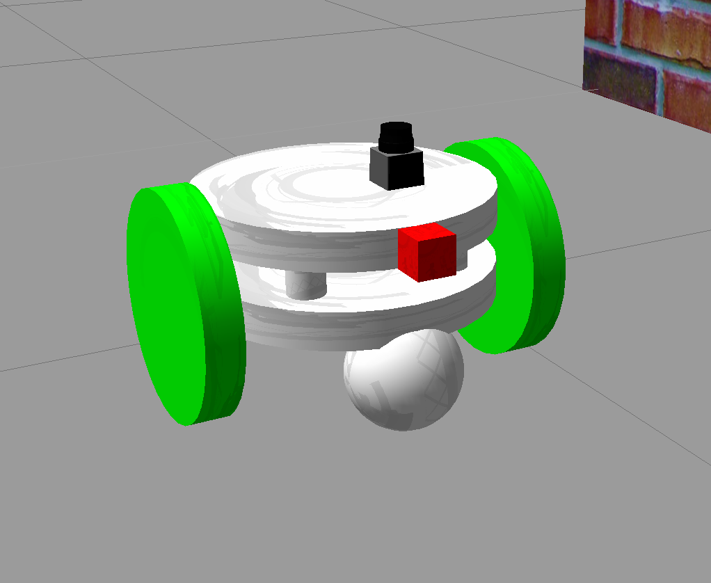
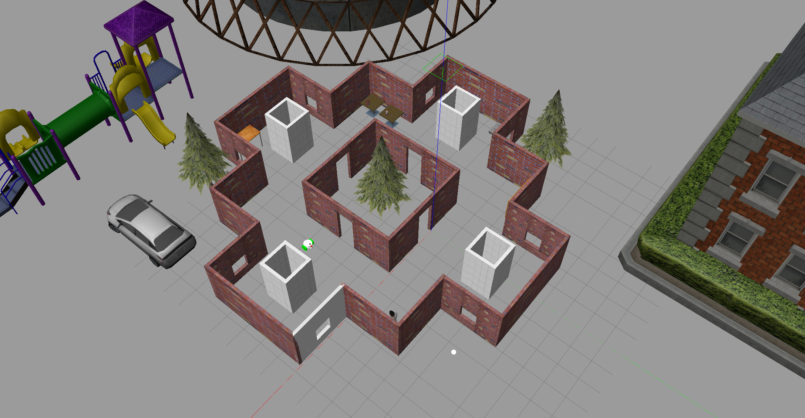
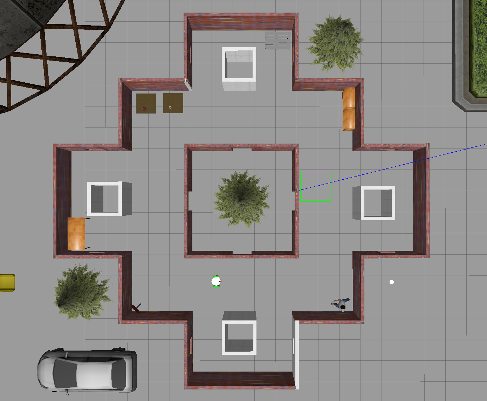
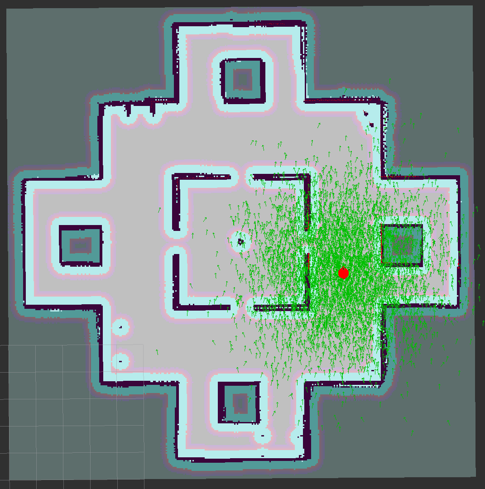
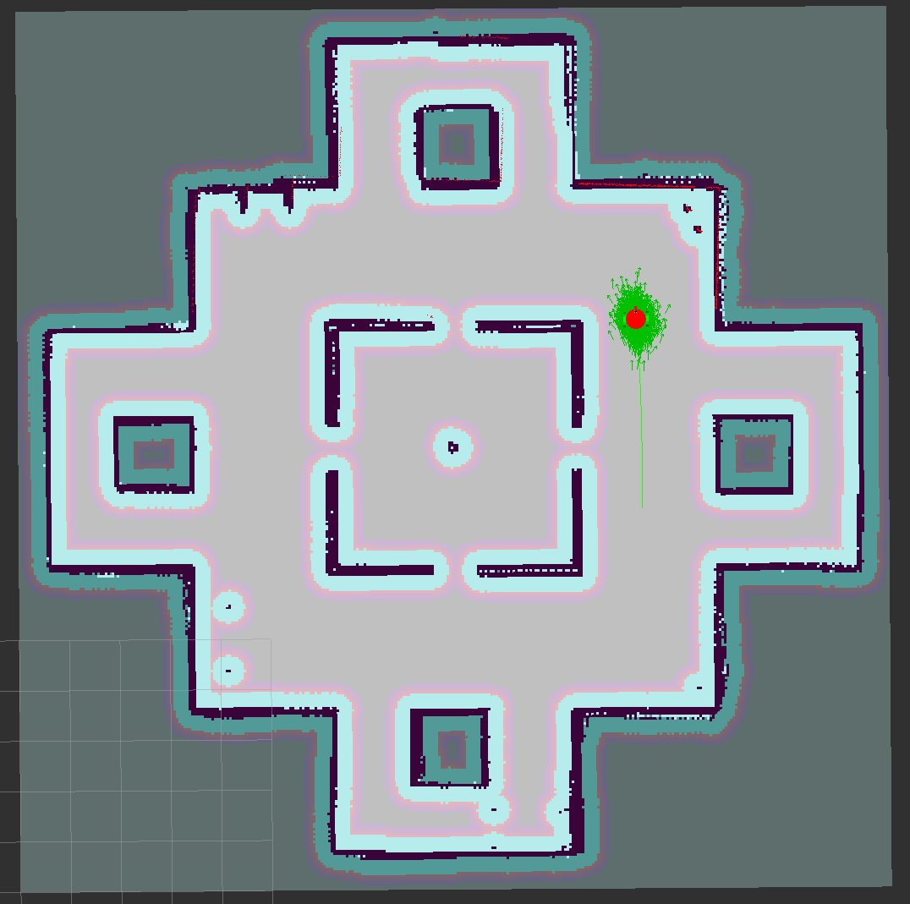
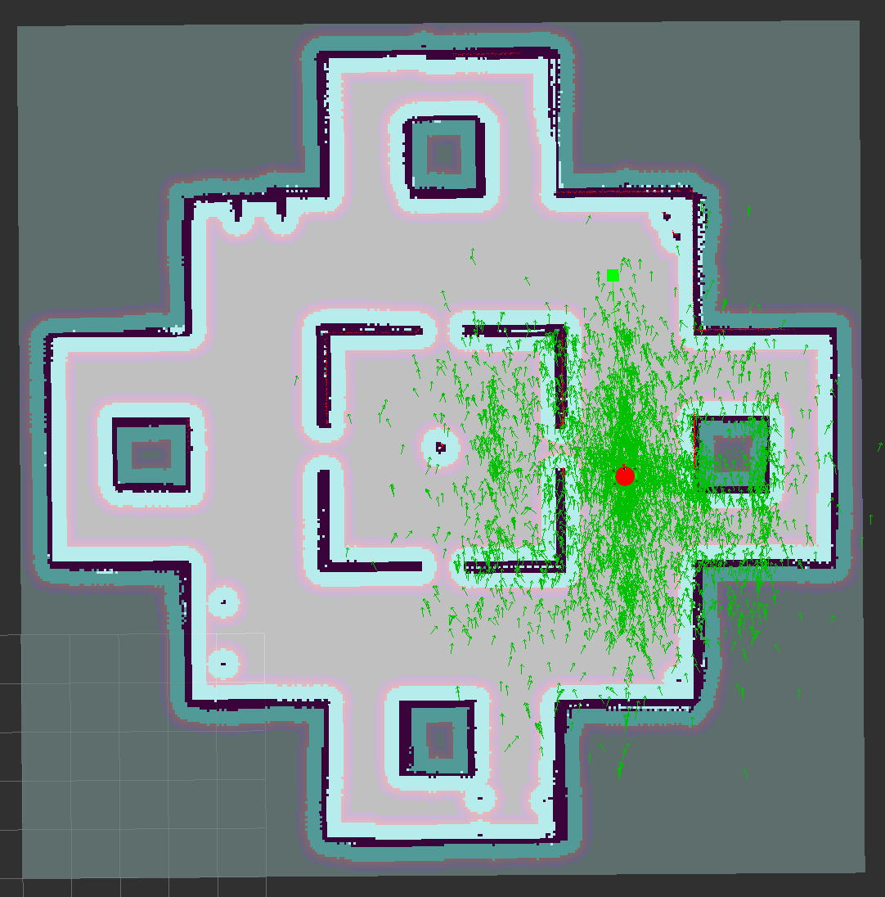

# Home Service Robot

## Overview

This is the final project for the Robotics Software Engineer Nanodegree program. Over the span of the course, I built a simulated robot and a simulated world in Gazebo. Using this robot and world, the final project showcases mapping, localization, and path planning within this world with the simulated robot utilizing ROS1 packages. The final objective for this project was to navigate to the pick-up position, wait 5 seconds, and navigate to a drop-off position. 

To run the entire program, ensure the workspace is built and sourced using `catkin_make && source devel/setup.bash` in the root directory and run `home_service.sh` in the `src/scripts` directory.

## Robot and World

The simulated robot is a two-wheel differential drive robot with a 2D laser scanner and a RGB-D camera. Estimated odometry information is additionally published from the `libgazebo_ros_diff_drive.so` Gazebo plugin. The robot itself is described in the `project_robot.xacro` and `project_robot.gazebo` files. The simulated robot is shown below:

The simulated environment contains a custom building made with Gazebo's building editor as well as assets from Gazebo's database. The custom building is rotationally symmetric, so unique features were added with assets to ensure that loop closure would behave as expected in the mapping step.

The simulated robot gains the ability to receive velocity commands from the `libgazebo_ros_diff_drive.so` Gazebo plugin. At a higher level, the system utilizes [move_base](http://wiki.ros.org/move_base) to convert goal poses to a sequence of velocity commands. We can utilize this functionality by interfacing with its action server.

## Mapping

The map used for this final project was created with [RTAB-Map](http://wiki.ros.org/rtabmap_ros). In this implementation of mapping, RTAB-Map utilizes odometry, 2D laser scan data, and RGB-D information in order to simultaneously create a 2D occupancy grid of the environment and identify its prior trajectories. RTAB-Map utilizes appearance-based methods with the RGB-D camera to identify potential loop closures, resulting in a better map. As the custom world was rotationally symmetric, parameter tuning on the loop closure parameters was necessary to ensure that loop closure did not happen too early. A screenshot of the mapping process is shown below:

The final RTAB-Map database file can be downloaded [here](https://drive.google.com/file/d/1TbcifvqDBU_A6sHIB885Yt0Qa8up-NWR/view).

Another method for mapping is [gmapping](http://wiki.ros.org/gmapping). I did not use gmapping for this project as I was able to generate a more accurate and more optimized map (in regards to loop closures) utilizing RTAB-Map.

## Localization

Localization for this project is achieved using [AMCL](http://wiki.ros.org/amcl). AMCL utilizes a dynamic particle filter, which changes the number of particles based on its parameters to estimate the most likely pose/orientation of the robot in a given map. Using the occupancy grid generated with RTAB-Map, AMCL allows for fast localization within the simulated environment utilizing only odometry and the 2D laser scan. Shown below is an image of the initial AMCL estimate and the estimate after convergence.

## Path Planning

Path Planning on the robot is primarily handled by [move_base](http://wiki.ros.org/move_base). However, for the purposes of this project, a custom package `pick_objects` was written to interface with move_base to go to the pick-up position and drop-off position. This package sends a command to move the robot to the pick-up position, wait 5 seconds for the virtual object to be picked up, and sends a command to move the robot to the drop-off position. Shown below is an image of the robot on a trajectory to the pick-up position:

## Visualization

To visualize all of this information in one place, we utilize [RViz](http://wiki.ros.org/rviz). In RViz, we can visualize the map, robot model, 2D scan, path planning visualizations, and markers. We create markers to represent virtual objects in the custom package `add_markers`. In this package, a virtual object is created in the pick-up position. Once the robot gets to this position, the object disappears to emulate it being picked up. Once the robot reaches the drop-off zone, the virtual object will reappear in that position to emulate the virtual object being dropped off.
